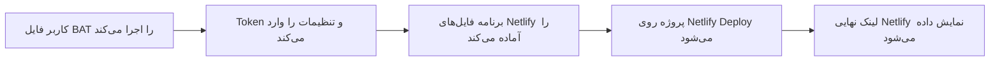
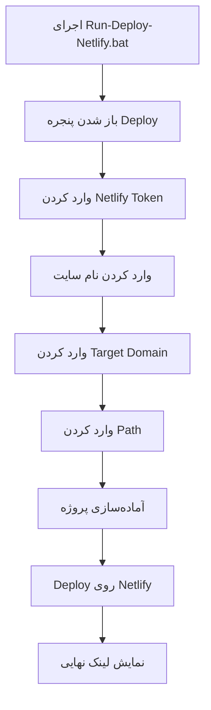

<div align="center">

<a href="https://t.me/amirsnet">
  
</a>


<br/>

[](#)
[](#)
[](#)
[](#)

<br/>

**زبان:** [🇮🇷 فارسی](README.md) • [🇬🇧 English](README_EN.md)

<br/>

[](https://t.me/Shakerfps)
[](https://t.me/amirsnet)
[](https://github.com/amirshaker000)
[](https://www.youtube.com/@AmirS-Net1)

</div>

---

<div dir="rtl">

# 🚀 Netlify Relay Deploy App

این پروژه برای این ساخته شده که کاربر بتواند فقط با اجرای یک فایل ساده‌ی ویندوزی، پروژه را روی **Netlify** دیپلوی کند.

کاربر لازم نیست Git بلد باشد، لازم نیست دستور دستی بزند، لازم نیست Netlify CLI را خودش نصب و تنظیم کند. کافی است فایل زیر را اجرا کند و اطلاعات لازم را وارد کند:

```text
Run-Deploy-Netlify.bat
```

بعد از اجرای فایل، برنامه مرحله‌به‌مرحله اطلاعات را می‌پرسد و در پایان لینک سایت Netlify را تحویل می‌دهد.

> [!IMPORTANT]
> تمرکز این README فقط روی روش Deploy با فایل `.bat` و Token است. آموزش Git Clone، نصب دستی CLI و روش‌های دستی داخل این راهنما نیامده تا کاربر مبتدی گیج نشود.

---

## 📑 فهرست مطالب

- [این پروژه دقیقاً چه کاری انجام می‌دهد؟](#-این-پروژه-دقیقاً-چه-کاری-انجام-میدهد)
- [قبل از شروع چه چیزهایی لازم است؟](#-قبل-از-شروع-چه-چیزهایی-لازم-است)
- [ساخت Netlify Token](#-ساخت-netlify-token)
- [آموزش Deploy با فایل BAT](#-آموزش-deploy-با-فایل-bat)
- [اطلاعاتی که برنامه از شما می‌خواهد](#-اطلاعاتی-که-برنامه-از-شما-میخواهد)
- [Target Domain و Path را از کجا برداریم؟](#-target-domain-و-path-را-از-کجا-برداریم)
- [ساختار فایل‌های پروژه](#-ساختار-فایلهای-پروژه)
- [بعد از Deploy چه چیزی دریافت می‌کنیم؟](#-بعد-از-deploy-چه-چیزی-دریافت-میکنیم)
- [VLESS Config Generator](#-vless-config-generator)
- [خطاهای رایج](#-خطاهای-رایج)
- [نکات امنیتی](#-نکات-امنیتی)
- [حمایت و ارتباط](#-حمایت-و-ارتباط)

---

## ✨ این پروژه دقیقاً چه کاری انجام می‌دهد؟

این پروژه یک ابزار Deploy آماده است. یعنی فایل‌های موردنیاز Netlify داخل پروژه آماده شده‌اند و اسکریپت Deploy فقط اطلاعات ضروری را از کاربر می‌گیرد.

روند کار به زبان ساده:



نتیجه‌ی نهایی چیزی شبیه این خواهد بود:

```text
https://your-site-name.netlify.app
```

---

## ✅ قبل از شروع چه چیزهایی لازم است؟

قبل از اینکه فایل `.bat` را اجرا کنید، این موارد را آماده داشته باشید:

| مورد | توضیح |
|---|---|
| ویندوز | چون اجرای اصلی پروژه با فایل `.bat` انجام می‌شود |
| اکانت Netlify | برای ساخت سایت و گرفتن لینک نهایی |
| Netlify Token | برای اینکه برنامه بتواند Deploy را خودکار انجام دهد |
| اطلاعات Inbound سرور/VPS | شامل `Target Domain` و `Path` |
| فایل‌های کامل پروژه | همه فایل‌ها باید کنار هم باشند و چیزی حذف نشده باشد |

> [!CAUTION]
> Netlify Token مثل رمز دسترسی است. آن را داخل README، GitHub، کانال، ویدیو یا اسکرین‌شات عمومی قرار ندهید.

---

## 🔑 ساخت Netlify Token

برای Deploy خودکار، برنامه به یک **Personal Access Token** از Netlify نیاز دارد.

مراحل ساخت Token:

1. وارد حساب Netlify شوید.
2. از بالا سمت راست وارد **User Settings** شوید.
3. وارد بخش **Applications** شوید.
4. بخش **Personal access tokens** را پیدا کنید.
5. روی **New access token** بزنید.
6. یک اسم دلخواه وارد کنید، مثلاً:

```text
netlify-relay-deploy
```

7. Token ساخته‌شده را کپی کنید.
8. هنگام اجرای برنامه، همان Token را وارد کنید.

> [!WARNING]
> Netlify معمولاً Token کامل را فقط همان لحظه نشان می‌دهد. همان موقع آن را کپی کنید و در جای امن نگه دارید.

---

## 🟢 آموزش Deploy با فایل BAT

برای شروع، روی فایل زیر دابل‌کلیک کنید:

```text
Run-Deploy-Netlify.bat
```

اگر ویندوز اجازه اجرا نداد، روی فایل راست‌کلیک کنید و گزینه زیر را بزنید:

```text
Run as administrator
```

بعد از باز شدن برنامه، معمولاً این مراحل را می‌بینید:



اگر همه چیز درست وارد شود، برنامه در پایان لینک Netlify را نمایش می‌دهد.

---

## 🧩 اطلاعاتی که برنامه از شما می‌خواهد

هنگام اجرای فایل `.bat`، برنامه چند مقدار از شما می‌گیرد.

| ورودی | معنی | از کجا تهیه شود؟ |
|---|---|---|
| `Netlify Token` | دسترسی لازم برای Deploy روی Netlify | از پنل Netlify |
| `Site Name` | نام سایت شما روی Netlify | دلخواه، انگلیسی و بدون فاصله |
| `Target Domain` | آدرس مقصدی که Relay باید به آن وصل شود | از پنل Inbound سرور/VPS |
| `Path` یا `Relay Path` | مسیر Inbound | از پنل Inbound سرور/VPS |
| `Template` | قالب صفحه اصلی سایت | از قالب‌های آماده داخل پروژه |

نمونه ورودی:

```text
Netlify Token : nfp_xxxxxxxxxxxxxxxxx
Site Name     : my-relay-app
Target Domain : https://example.com:443
Path          : /api
```

> [!TIP]
> نام سایت را ساده، انگلیسی و بدون فاصله انتخاب کنید. مثلاً `my-relay-app` یا `amir-netlify-relay`.

---

## 🎯 Target Domain و Path را از کجا برداریم؟

این بخش مهم‌ترین قسمت تنظیمات است.

`Target Domain` و `Path` نباید شانسی یا دلخواه وارد شوند. این دو مقدار باید از **پنل Inbound سرور/VPS** گرفته شوند؛ همان پنلی که Inbound اصلی داخل آن ساخته شده است.

### Target Domain چیست؟

`Target Domain` آدرس مقصدی است که Netlify Relay درخواست‌ها را به آن ارسال می‌کند.

نمونه‌ها:

```text
https://your-domain.com
https://your-domain.com:443
https://sub.your-domain.com
```

اگر داخل پنل Inbound دامنه، هاست یا آدرس سرور مشخص شده، همان مقدار را با پروتکل درست وارد کنید.

### Path چیست؟

`Path` همان مسیر Inbound است.

مثلاً اگر داخل پنل Inbound مسیر شما این باشد:

```text
/api
```

داخل برنامه Deploy هم باید دقیقاً همین مقدار را وارد کنید:

```text
/api
```

نمونه‌های رایج:

```text
/api
/xhttp
/relay
```

> [!IMPORTANT]
> مقدار `Path` داخل Netlify باید با Path داخل Inbound یکی باشد. اگر این دو مقدار فرق داشته باشند، ممکن است Deploy موفق شود اما اتصال کار نکند.

### مثال کامل

فرض کنید داخل پنل Inbound این اطلاعات را دارید:

```text
Domain : panel-example.com
Port   : 443
Path   : /api
```

پس داخل برنامه Deploy این‌طور وارد کنید:

```text
Target Domain : https://panel-example.com:443
Path          : /api
```

---

## 📁 ساختار فایل‌های پروژه

ساختار پروژه به‌صورت خلاصه این شکلی است:

```text
netlify-installer/
├── Run-Deploy-Netlify.bat
├── Deploy-Netlify.ps1
├── netlify.toml
├── package.json
├── .env.example
│
├── netlify/
│   ├── edge-functions/
│   │   └── relay.js
│   └── functions/
│       └── relay.mjs
│
├── public/
│   ├── index.html
│   ├── landing-page.html
│   ├── _headers
│   └── _redirects
│
├── scripts/
│   └── prepare-build.mjs
│
├── templates/
│   └── landing/
│
└── vless-config-generator/
```

### کاربرد فایل‌ها

| فایل / پوشه | کاربرد |
|---|---|
| `Run-Deploy-Netlify.bat` | فایل شروع سریع؛ کاربر با دابل‌کلیک Deploy را اجرا می‌کند |
| `Deploy-Netlify.ps1` | اسکریپت اصلی Deploy که توسط فایل `.bat` اجرا می‌شود |
| `netlify.toml` | تنظیمات Netlify، مسیرها و Build |
| `package.json` | اطلاعات پروژه و وابستگی‌ها |
| `.env.example` | نمونه متغیرهای موردنیاز |
| `netlify/functions/` | Functionهای Netlify |
| `netlify/edge-functions/` | Edge Functionهای Netlify برای Relay |
| `public/` | فایل‌های صفحه اصلی سایت |
| `templates/landing/` | قالب‌های آماده Landing Page |
| `scripts/` | اسکریپت‌های کمکی پروژه |
| `vless-config-generator/` | برنامه دسکتاپ ساخت کانفیگ VLESS |

---

## 🎉 بعد از Deploy چه چیزی دریافت می‌کنیم؟

بعد از پایان موفق Deploy:

- سایت شما روی Netlify ساخته می‌شود.
- لینک نهایی Netlify نمایش داده می‌شود.
- تنظیمات Relay روی پروژه اعمال می‌شود.
- Function یا Edge Functionهای پروژه فعال می‌شوند.

لینک نهایی معمولاً شبیه این است:

```text
https://your-site-name.netlify.app
```

اگر سایت باز شد ولی اتصال درست کار نکرد، اول این موارد را بررسی کنید:

```text
Target Domain
Path
Inbound Panel Settings
Netlify Deploy Logs
```

---

## 🧪 VLESS Config Generator

در کنار Deploy App، یک ابزار دسکتاپ هم می‌توانید داخل پروژه داشته باشید: **VLESS Config Generator**

این برنامه با **React + Vite + Tailwind CSS + Electron** ساخته شده و برای ساخت کانفیگ‌های VLESS استفاده می‌شود.

### این برنامه چه کاری می‌کند؟

برنامه دو لیست از شما می‌گیرد:

```text
Address List
SNI List
```

بعد همه ترکیب‌های ممکن را می‌سازد و خروجی VLESS تولید می‌کند.

با داده‌های پیش‌فرض:

```text
81 addresses × 47 SNI domains = 3807 configs
```

یعنی برنامه می‌تواند تا **3807 کانفیگ** بسازد.

### قابلیت‌ها

| قابلیت | توضیح |
|---|---|
| ساخت کانفیگ ترکیبی | ترکیب Addressها با SNIها |
| پشتیبانی از Domain و IP | Address می‌تواند دامنه یا IP باشد |
| کنترل SNI | فقط دامنه به‌عنوان SNI قبول می‌شود و IPها نادیده گرفته می‌شوند |
| ویرایش لیست‌ها | Address List و SNI List قابل ویرایش هستند |
| خروجی گرفتن | کپی همه کانفیگ‌ها یا دانلود فایل `.txt` |
| Ping واقعی | تست ICMP واقعی داخل نسخه Electron |
| حالت‌های Ping | همه آدرس‌ها، فقط IPها، فقط SNIها یا Target دستی |
| تست هم‌زمان | Pingها به‌صورت Concurrent انجام می‌شوند |
| انتخاب موفق‌ها | فقط نتایج موفق را جدا می‌کند و می‌توان دوباره به لیست‌ها برگرداند |

> [!NOTE]
> این ابزار برای ساخت و تست کانفیگ بعد از Deploy است. خود Deploy اصلی همچنان با `Run-Deploy-Netlify.bat` انجام می‌شود.

---

## 🛠️ خطاهای رایج

<details>
<summary><b>برنامه می‌گوید Token اشتباه است</b></summary>

<br/>

این موارد را بررسی کنید:

- Token را کامل کپی کرده باشید.
- قبل یا بعد Token فاصله اضافه نباشد.
- Token را از بخش Personal Access Tokens ساخته باشید.
- اگر Token قدیمی یا لو رفته است، آن را حذف کنید و Token جدید بسازید.

</details>

<details>
<summary><b>Deploy انجام شد ولی اتصال کار نمی‌کند</b></summary>

<br/>

معمولاً مشکل از یکی از این موارد است:

- `Target Domain` اشتباه وارد شده است.
- `Path` با Path داخل Inbound یکی نیست.
- Inbound روی VPS فعال نیست.
- پورت یا TLS در سرور درست تنظیم نشده است.
- متغیرهای Netlify درست ثبت نشده‌اند.

</details>

<details>
<summary><b>فایل BAT باز نمی‌شود یا سریع بسته می‌شود</b></summary>

<br/>

روی فایل راست‌کلیک کنید و گزینه **Run as administrator** را بزنید.

اگر باز هم بسته شد، ممکن است PowerShell اجازه اجرای اسکریپت را نداشته باشد یا فایل‌های پروژه ناقص باشند.

</details>

<details>
<summary><b>نمی‌دانم Path و Target را چه وارد کنم</b></summary>

<br/>

وارد پنل Inbound سرور/VPS شوید و مقدارهای Domain/Host و Path را از همان‌جا بردارید.

این دو مقدار باید با تنظیمات Inbound یکی باشند، نه مقدار دلخواه.

</details>

---

## 🔐 نکات امنیتی

قبل از Public کردن پروژه در GitHub، این موارد را رعایت کنید:

- فایل `.env` را Public نکنید.
- Netlify Token را داخل هیچ فایلی ننویسید.
- Token را داخل README قرار ندهید.
- اسکرین‌شات‌هایی که Token داخلشان دیده می‌شود منتشر نکنید.
- اگر Token لو رفت، سریع آن را از Netlify حذف کنید و Token جدید بسازید.

> [!CAUTION]
> هرکسی Token شما را داشته باشد، ممکن است بتواند به پروژه‌های Netlify شما دسترسی عملیاتی داشته باشد.

---

## 🛡️ استفاده مسئولانه

این پروژه فقط برای استفاده شخصی، آموزشی و مدیریت پروژه‌های خودتان منتشر شده است.

از این پروژه برای دسترسی غیرمجاز، سوءاستفاده از سرویس‌ها، نقض قوانین یا آسیب زدن به دیگران استفاده نکنید.

---

</div>

<div align="center">

## 💖 حمایت و ارتباط

اگر پروژه برایتان مفید بود، می‌توانید از طریق لینک زیر حمایت کنید:

[](https://reymit.ir/amirshaker)

<br/>

### Crypto Donation

| Network | Address |
|---|---|
| **TRON - TRC20** | `TTD16BMMShWCMymAgHoFgxp6s6WRksJmxk` |
| **Solana** | `E7S8EBUE5tkY5UaTgDvhaanJMeCi2DxPGYZukJGrJV8J` |

<br/>

### Creator

| Platform | Link |
|---|---|
| Telegram ID | [@Shakerfps](https://t.me/Shakerfps) |
| Telegram Channel | [@amirsnet](https://t.me/amirsnet) |
| GitHub | [amirshaker000](https://github.com/amirshaker000) |
| YouTube | [@AmirS-Net1](https://www.youtube.com/@AmirS-Net1) |

<br/>

---


Made with ❤️ by **Amir Shaker**

</div>
