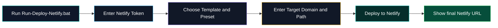

<div align="center">

<a href="https://github.com/amirshaker000/netlify-relay">
  
</a>


<br/>

[](#)
[](#)
[](#)
[](#)

<br/>

**Language:** [🇮🇷 فارسی](README.md) • [🇬🇧 English](README_EN.md)

<br/>

[](https://t.me/Shakerfps)
[](https://t.me/amirsnet)
[](https://t.me/avaco_cloud)
[](https://github.com/amirshaker000)
[](https://www.youtube.com/@AmirS-Net1)

</div>

---

# 🚀 Netlify Relay Deploy App

This project helps users deploy a ready Netlify Relay project by running one simple Windows file.

The main starting file is:

```text
Run-Deploy-Netlify.bat
```

The user does not need Git knowledge, manual commands, manual CLI setup, or complicated configuration. The app asks for the required values step by step and then shows the final Netlify URL.

> [!IMPORTANT]
> This README focuses on deployment through the `.bat` file and Netlify Token. The goal is to make it clear for beginners what to do after opening the BAT file.

---

## 📑 Table of Contents

- [Download](#-download)
- [What does this project do?](#-what-does-this-project-do)
- [Requirements](#-requirements)
- [Create a Netlify Token](#-create-a-netlify-token)
- [Deploy with the BAT file](#-deploy-with-the-bat-file)
- [Where do Target Domain and Path come from?](#-where-do-target-domain-and-path-come-from)
- [Project structure](#-project-structure)
- [VLESS Config Creator](#-vless-config-creator)
- [Patch Notes](#-patch-notes)
- [Common issues](#-common-issues)
- [Security notes](#-security-notes)
- [Thanks and credits](#-thanks-and-credits)
- [Support and links](#-support-and-links)

---

## 📦 Download

Download the ready-to-use files from GitHub Releases:

[](https://github.com/amirshaker000/netlify-relay/releases/latest)

The release contains two separate files:

| File | Description |
|---|---|
| `netlify-installer-v2.0.0.zip` | Main project for deploying to Netlify with the `.bat` file |
| `vless-config-creator-v2.0.0.zip` | Separate desktop app for VLESS config generation and ping testing |

> [!NOTE]
> **VLESS Config Creator** is released separately because it is larger and should be downloaded only when needed.

---

## ✨ What does this project do?

This project is a ready-to-use Netlify deployment app. The required Netlify files are already included, and the user only needs to run the BAT file and enter a few values.

Simple flow:



Final result looks like this:

```text
https://your-site-name.netlify.app
```

---

## ✅ Requirements

Prepare these items before running the app:

| Item | Description |
|---|---|
| Windows | The main launcher is `Run-Deploy-Netlify.bat` |
| Netlify Account | Required to create and publish the final site |
| Netlify Token | Allows the app to deploy automatically |
| Inbound VPS/server details | Includes `Target Domain` and `Path` |
| Full project files | Download and extract the release package |

---

## 🔑 Create a Netlify Token

1. Sign in to your Netlify account.
2. Open User Settings.
3. Go to Applications.
4. Open Personal Access Tokens.
5. Create a new token.
6. Copy it and enter it only when the BAT app asks for it.

> [!WARNING]
> Do not put your token inside README files, project files, screenshots, or GitHub commits.

---

## 🚀 Deploy with the BAT file

After downloading and extracting the project:

1. Double-click this file:

```text
Run-Deploy-Netlify.bat
```

2. If Windows Defender or SmartScreen shows a warning, make sure you downloaded the file from the official release, then allow it.
3. Enter your Netlify Token.
4. Enter the site name, template, preset, Target Domain, and Path.
5. The app prepares the Netlify files.
6. The deployment starts.
7. At the end, the final Netlify URL is shown.

Example inputs:

```text
Netlify Token : **************
Site Name     : my-relay-site
Template      : default
Preset        : standard
Target Domain : https://example.com
Path          : /api
```

---

## 🎯 Where do Target Domain and Path come from?

`Target Domain` and `Path` must not be guessed. These values must be copied from your **Inbound panel on the VPS/server**, where the original inbound is configured.

### What is Target Domain?

`Target Domain` is the destination address that the Netlify Relay should forward requests to.

Examples:

```text
https://your-domain.com
https://your-domain.com:443
```

### What is Path?

`Path` is the inbound path and must exactly match the path in your inbound panel.

Examples:

```text
/api
/xhttp
/relay
```

> [!CAUTION]
> If the `Path` used in Netlify is different from the inbound path, deployment may succeed but the connection may not work.

Example from an inbound panel:

```text
Protocol      : VLESS / XHTTP
Domain / Host : your-domain.com
Port          : 443
Path          : /api
```

Values to enter in the app:

```text
Target Domain : https://your-domain.com:443
Path          : /api
```

---

## 🧩 Project structure

Main project structure:

```text
netlify-relay/
├─ netlify/
│  └─ edge-functions/        # Relay files for Netlify Edge Functions
├─ public/                   # Public site files
├─ scripts/                  # Helper deployment scripts
├─ templates/                # Ready site templates for deployment
├─ Deploy-Netlify.ps1        # Main PowerShell deployment script
├─ Run-Deploy-Netlify.bat    # Main Windows launcher
├─ netlify.toml              # Netlify configuration
├─ package.json              # Project dependencies
├─ README.md                 # Persian guide
└─ README_EN.md              # English guide
```

Short explanation:

| Part | Usage |
|---|---|
| `Run-Deploy-Netlify.bat` | Main file that the user runs |
| `Deploy-Netlify.ps1` | Main deployment and preparation logic |
| `netlify/edge-functions` | Relay layer on Netlify |
| `templates` | Site templates selectable during deployment |
| `scripts` | Helper tools for setup, build, and checks |
| `public` | Public website files |

---

## 🧪 VLESS Config Creator

This project also includes a separate tool called **VLESS Config Creator**.

It generates VLESS configs by combining Address and SNI lists, and the Electron desktop version includes real ping testing.

Main features:

- Generate VLESS configs from Address List and SNI List combinations
- Support domains and IP addresses as Address
- Allow only domains as SNI
- Automatically ignore IP addresses in the SNI list
- Copy all generated configs
- Download generated configs as `.txt`
- Real ping testing inside the Electron version
- Select successful results and apply them back to lists
- Credits and donation section inside the UI

> [!NOTE]
> This app is provided as a separate release asset and does not need to be stored inside the main Netlify Relay source code.

---

## 📝 Patch Notes

### v2.0.0

- Added site templates for deployment
- Added deployment presets
- Added Health Check after deployment
- Added deployment through `.bat`
- Added deployment with Netlify Token
- Simplified the flow for beginner users
- Split VLESS Config Creator from the main project for separate download
- Improved project folder and file structure
- Added Persian and English README files
- Added Download and Release Assets section
- Added Credits, Donation, and contact links

---

## 🐛 Common issues

<details>
<summary><b>The BAT file does not run</b></summary>

- Right-click the file and try Run as administrator.
- Make sure you downloaded it from the official release of this project.
- If PowerShell execution is restricted, the app window usually shows the required guidance.

</details>

<details>
<summary><b>Deployment succeeds but connection does not work</b></summary>

Check these items:

- `Target Domain` is correct.
- `Path` exactly matches the path inside your inbound panel.
- The inbound on your VPS/server is running.
- Server port and TLS settings are correct.

</details>

<details>
<summary><b>Token is rejected</b></summary>

- Create a new token from Netlify.
- Do not paste extra spaces before or after the token.
- Make sure the token belongs to the correct Netlify account.

</details>

---

## 🔐 Security notes

Before publishing the project on GitHub:

- Do not publish your real `.env` file.
- Do not write your Netlify Token inside any file or README.
- Do not publish screenshots that show your token.
- If the token is leaked, delete it immediately and create a new one.
- Keep only `.env.example` in GitHub.

---

## 🙏 Thanks and credits

Special thanks for inspiration, help, and useful projects:

<table>
<tr>
<td align="center">
<a href="https://github.com/B3hnamR">
<br/>
<b>@B3hnamR</b>
</a>
</td>
<td align="center">
<a href="https://github.com/avacocloud">
<br/>
<b>@avacocloud</b>
</a>
</td>
<td align="center">
<a href="https://github.com/amirshaker000">
<br/>
<b>@amirshaker000</b>
</a>
</td>
</tr>
</table>

**Team Channel:** [@avaco_cloud](https://t.me/avaco_cloud)

---

<div align="center">

## 💖 Support and links

If this project helped you, you can support it here:

[](https://reymit.ir/amirshaker)

<br/>

### Crypto Donation

| Network | Address |
|---|---|
| **TRON - TRC20** | `TTD16BMMShWCMymAgHoFgxp6s6WRksJmxk` |
| **Solana** | `E7S8EBUE5tkY5UaTgDvhaanJMeCi2DxPGYZukJGrJV8J` |

<br/>

### Creator

| Platform | Link |
|---|---|
| Telegram ID | [@Shakerfps](https://t.me/Shakerfps) |
| Telegram Channel | [@amirsnet](https://t.me/amirsnet) |
| Team Channel | [@avaco_cloud](https://t.me/avaco_cloud) |
| GitHub | [amirshaker000](https://github.com/amirshaker000) |
| YouTube | [@AmirS-Net1](https://www.youtube.com/@AmirS-Net1) |

<br/>

---


Made with ❤️ by **Amir Shaker**

</div>
