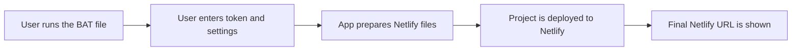
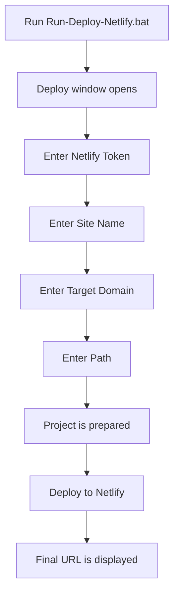

<div align="center">

<a href="https://t.me/amirsnet">
  
</a>


<br/>

[](#)
[](#)
[](#)
[](#)

<br/>

**Language:** [🇮🇷 فارسی](README.md) • [🇬🇧 English](README_EN.md)

<br/>

[](https://t.me/Shakerfps)
[](https://t.me/amirsnet)
[](https://github.com/amirshaker000)
[](https://www.youtube.com/@AmirS-Net1)

</div>

---

# 🚀 Netlify Relay Deploy App

This project is made for users who want to deploy a ready Netlify relay project by running one simple Windows file.

The user does not need to know Git, does not need to run manual commands, and does not need to install or configure Netlify CLI manually. The main starting point is:

```text
Run-Deploy-Netlify.bat
```

After running it, the app asks for the required values step by step and deploys the project to Netlify.

> [!IMPORTANT]
> This README focuses only on deployment through the `.bat` app and Netlify Token. Manual Git clone, manual CLI setup, and manual deployment instructions are intentionally not included to keep the guide simple for beginners.

---

## 📑 Table of Contents

- [What does this project do?](#-what-does-this-project-do)
- [Requirements](#-requirements)
- [Create a Netlify Token](#-create-a-netlify-token)
- [Deploy with the BAT file](#-deploy-with-the-bat-file)
- [Inputs requested by the app](#-inputs-requested-by-the-app)
- [Where do Target Domain and Path come from?](#-where-do-target-domain-and-path-come-from)
- [Project structure](#-project-structure)
- [After deployment](#-after-deployment)
- [VLESS Config Generator](#-vless-config-generator)
- [Common issues](#-common-issues)
- [Security notes](#-security-notes)
- [Support and links](#-support-and-links)

---

## ✨ What does this project do?

This project is a ready-to-use deployment app. The Netlify files are already included, and the deployment script only asks the user for the required values.

Simple flow:



Final result looks like this:

```text
https://your-site-name.netlify.app
```

---

## ✅ Requirements

Before running the `.bat` file, prepare these items:

| Item | Description |
|---|---|
| Windows | The main launcher is a `.bat` file |
| Netlify account | Required for creating the final Netlify site |
| Netlify Token | Allows the app to deploy automatically |
| Inbound VPS/server details | Includes `Target Domain` and `Path` |
| Complete project files | Keep all project files together and do not delete required files |

> [!CAUTION]
> A Netlify Token works like an access key. Do not publish it in README files, GitHub repositories, channels, videos, screenshots, or public chats.

---

## 🔑 Create a Netlify Token

The deploy app needs a **Personal Access Token** from Netlify.

Steps:

1. Log in to your Netlify account.
2. Open **User Settings** from the top-right menu.
3. Go to **Applications**.
4. Find **Personal access tokens**.
5. Click **New access token**.
6. Enter a name, for example:

```text
netlify-relay-deploy
```

7. Copy the generated token.
8. Paste that token inside the deploy app when it asks for it.

> [!WARNING]
> Netlify usually shows the full token only once. Copy it immediately and keep it somewhere safe.

---

## 🟢 Deploy with the BAT file

To start the deployment, double-click this file:

```text
Run-Deploy-Netlify.bat
```

If Windows blocks execution, right-click the file and choose:

```text
Run as administrator
```

Typical deployment flow:



If all values are correct, the app shows your final Netlify URL at the end.

---

## 🧩 Inputs requested by the app

When you run the `.bat` file, the app may ask for these values:

| Input | Meaning | Where to get it |
|---|---|---|
| `Netlify Token` | Access token used for deployment | Netlify panel |
| `Site Name` | Your Netlify site name | Choose a simple English name without spaces |
| `Target Domain` | The destination your relay should connect to | Inbound panel on your VPS/server |
| `Path` or `Relay Path` | The inbound connection path | Inbound panel on your VPS/server |
| `Template` | Landing page template | Project templates folder |

Example:

```text
Netlify Token : nfp_xxxxxxxxxxxxxxxxx
Site Name     : my-relay-app
Target Domain : https://example.com:443
Path          : /api
```

> [!TIP]
> Use a clean English site name without spaces, such as `my-relay-app` or `amir-netlify-relay`.

---

## 🎯 Where do Target Domain and Path come from?

This is the most important part of the setup.

`Target Domain` and `Path` must not be guessed. These two values must be taken from your **Inbound panel on the VPS/server**, where the original inbound is configured.

### What is Target Domain?

`Target Domain` is the destination address that the Netlify relay forwards requests to.

Examples:

```text
https://your-domain.com
https://your-domain.com:443
https://sub.your-domain.com
```

If your inbound panel shows a domain, host, or server address, use that value with the correct protocol.

### What is Path?

`Path` is the inbound path.

For example, if your inbound panel shows:

```text
/api
```

you must enter the same value inside the deploy app:

```text
/api
```

Common examples:

```text
/api
/xhttp
/relay
```

> [!IMPORTANT]
> The `Path` used in Netlify must match the inbound path exactly. If they are different, deployment may succeed but the connection may not work.

### Full example

Suppose your inbound panel contains:

```text
Domain : panel-example.com
Port   : 443
Path   : /api
```

Then enter this in the deploy app:

```text
Target Domain : https://panel-example.com:443
Path          : /api
```

---

## 📁 Project structure

The project structure is roughly:

```text
netlify-installer/
├── Run-Deploy-Netlify.bat
├── Deploy-Netlify.ps1
├── netlify.toml
├── package.json
├── .env.example
│
├── netlify/
│   ├── edge-functions/
│   │   └── relay.js
│   └── functions/
│       └── relay.mjs
│
├── public/
│   ├── index.html
│   ├── landing-page.html
│   ├── _headers
│   └── _redirects
│
├── scripts/
│   └── prepare-build.mjs
│
├── templates/
│   └── landing/
│
└── vless-config-generator/
```

### File and folder roles

| File / Folder | Purpose |
|---|---|
| `Run-Deploy-Netlify.bat` | Quick start launcher; double-click this file to start deployment |
| `Deploy-Netlify.ps1` | Main deployment script launched by the BAT file |
| `netlify.toml` | Netlify configuration, routes, and build settings |
| `package.json` | Project metadata and dependencies |
| `.env.example` | Example environment variables |
| `netlify/functions/` | Netlify Functions |
| `netlify/edge-functions/` | Netlify Edge Functions for relay behavior |
| `public/` | Public landing page files |
| `templates/landing/` | Ready landing page templates |
| `scripts/` | Helper scripts |
| `vless-config-generator/` | Desktop VLESS configuration generator app |

---

## 🎉 After deployment

After a successful deployment:

- A Netlify site is created.
- The final Netlify URL is displayed.
- Relay settings are applied to the project.
- Netlify Functions or Edge Functions are enabled.

The final URL usually looks like this:

```text
https://your-site-name.netlify.app
```

If the site opens but the connection does not work, check these first:

```text
Target Domain
Path
Inbound Panel Settings
Netlify Deploy Logs
```

---

## 🧪 VLESS Config Generator

This project can also include a desktop helper app called **VLESS Config Generator**.

It is built with **React + Vite + Tailwind CSS + Electron** and is used to generate VLESS configurations.

### What does it do?

The app takes two lists:

```text
Address List
SNI List
```

Then it combines them and generates VLESS configs.

With the default data:

```text
81 addresses × 47 SNI domains = 3807 configs
```

So the app can generate up to **3807 configs** from the built-in default lists.

### Features

| Feature | Description |
|---|---|
| Combination-based generation | Combines addresses with SNI domains |
| Domain and IP support | Address can be a domain or IP |
| SNI validation | Only domains are accepted as SNI; IP addresses are ignored |
| Editable lists | Address List and SNI List can be edited |
| Export output | Copy all configs or download as `.txt` |
| Real ping test | Real ICMP ping test inside Electron |
| Ping modes | All addresses, IP only, SNI only, or manual target |
| Concurrent testing | Ping tests run concurrently for faster results |
| Successful result selection | Select only successful results and apply them back to lists |

> [!NOTE]
> This tool is for generating and testing configs after deployment. The main deployment process is still done through `Run-Deploy-Netlify.bat`.

---

## 🛠️ Common issues

<details>
<summary><b>The app says the token is invalid</b></summary>

<br/>

Check these items:

- Make sure the token was copied completely.
- Make sure there are no extra spaces before or after the token.
- Make sure the token was created from Personal Access Tokens.
- If the token is old or leaked, delete it and create a new one.

</details>

<details>
<summary><b>Deployment succeeds but connection does not work</b></summary>

<br/>

Common causes:

- `Target Domain` is wrong.
- `Path` does not match the path inside your inbound panel.
- The inbound on the VPS/server is not active.
- Port or TLS settings on the server are wrong.
- Netlify environment variables were not applied correctly.

</details>

<details>
<summary><b>The BAT file does not open or closes immediately</b></summary>

<br/>

Right-click the file and choose **Run as administrator**.

If it still closes, PowerShell execution permissions may be blocked or the project files may be incomplete.

</details>

<details>
<summary><b>I do not know what to enter for Target or Path</b></summary>

<br/>

Open the inbound panel on your VPS/server and copy the Domain/Host and Path values from there.

These values must match your inbound settings. They are not random values.

</details>

---

## 🔐 Security notes

Before publishing the project on GitHub, follow these rules:

- Do not publish your `.env` file.
- Do not write your Netlify Token inside any project file.
- Do not put the token in the README.
- Do not publish screenshots that show your token.
- If the token is leaked, delete it from Netlify immediately and create a new one.

> [!CAUTION]
> Anyone with your Netlify Token may be able to perform actions on your Netlify projects.

---

## 🛡️ Responsible use

This project is provided for personal, educational, and self-managed project deployment use.

Do not use it for unauthorized access, abuse of services, rule violations, or harming others.

---

<div align="center">

## 💖 Support and links

If this project helped you, you can support it here:

[](https://reymit.ir/amirshaker)

<br/>

### Crypto Donation

| Network | Address |
|---|---|
| **TRON - TRC20** | `TTD16BMMShWCMymAgHoFgxp6s6WRksJmxk` |
| **Solana** | `E7S8EBUE5tkY5UaTgDvhaanJMeCi2DxPGYZukJGrJV8J` |

<br/>

### Creator

| Platform | Link |
|---|---|
| Telegram ID | [@Shakerfps](https://t.me/Shakerfps) |
| Telegram Channel | [@amirsnet](https://t.me/amirsnet) |
| GitHub | [amirshaker000](https://github.com/amirshaker000) |
| YouTube | [@AmirS-Net1](https://www.youtube.com/@AmirS-Net1) |

<br/>

---


Made with ❤️ by **Amir Shaker**

</div>
